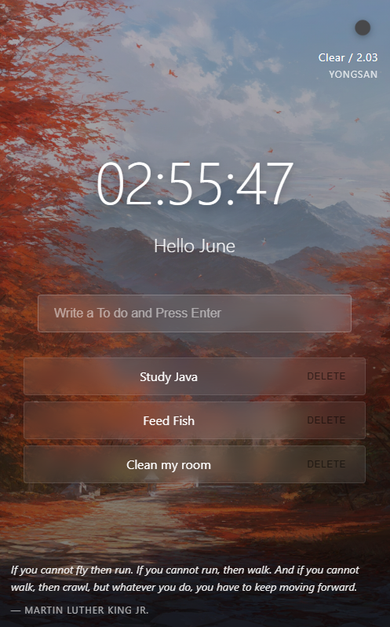

# Momentum Clone 🌟

A simple web project inspired by the popular **Momentum** dashboard.  

Check it out live here:  
[🌐 Visit the Live Site](https://wardren2.github.io/momentum/)

---

## Preview

<table>
  <tr>
    <td>
      
    </td>
    <td>
      <ul>
        <li>Beautiful background images</li>
        <li>Current time display</li>
        <li>Daily focus setting</li>
        <li>Personalized greeting</li>
        <li>Minimalistic design</li>
      </ul>
    </td>
  </tr>
</table>

---

## How to Use

1. Click the link above to open the live site.
2. Enjoy the daily focus and beautiful background!
3. Optionally, fork this repository to customize and experiment.

---

## Built With

- HTML
- CSS
- JavaScript
- GitHub Pages

---

If you like this project, give it a ⭐!
